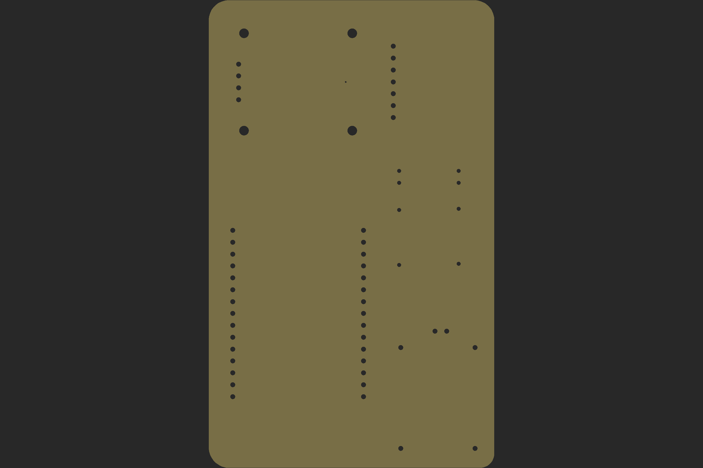

# Pulse Oximeter

## Introduction

This project is DIY pulse oximeter sensor developed using MAX30100 sensor.

## Folder Structure

1. docs/top.png : PCB Board top Design
2. docs/bottom.png : PCB Board bottom design
3. docs/drills.png : PCB Board drills design
4. eagle-design : PCB design
5. html-template : HTML report template used in ino.
6. pulse-oximeter : Arduino code

## Component Used

1. NodeMCU (x1) - [Tomson Electronics](https://www.tomsonelectronics.com/products/buy-nodemcu-esp8266-esp-12e-with-ch340-online)
2. TP4056 Board (x1) - [FLYROBO](https://www.flyrobo.in/tp4056-1a-li-ion-lithium-battery-charging-module-mini-usb)
3. Resistor (220 Ohms) (x2) - [Tomson Electronics](https://www.tomsonelectronics.com/products/100k-ohm-metal-film-resistor?variant=8737726038107)
4. LED (Red) (x2) - [Tomson Electronics](https://www.tomsonelectronics.com/products/led-basic-red-5mm-pack-of-10)
5. 0.96 Inch OLED Display - [Tomson Electronics](https://www.tomsonelectronics.com/products/0-96-inch-128-x-64-i2c-iic-4pin-oled-display-module-blue)
6. Female headers - [Robu (India)](https://robu.in/product/2mm-pitch-female-berg-strip-40x1-2pcs/)

## PCB Design

### Top Design

### Bottom Design

### Drills Design

